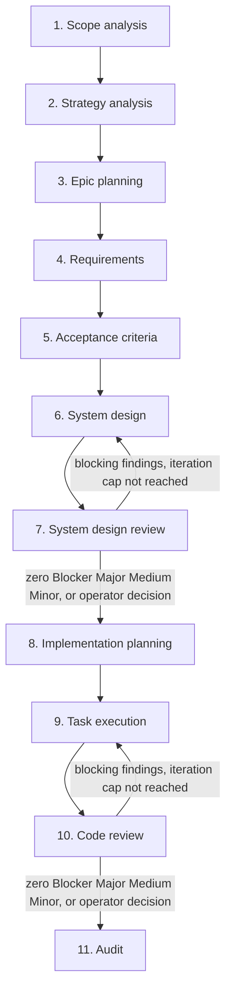
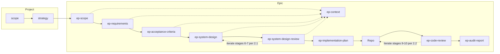

# SDLC Pipeline — ai-sdlc

**Purpose:** This document specifies the agentic SDLC process: **11 stages** from project scope analysis through strategy, epic planning, requirements, acceptance criteria, system design, system design review, implementation planning, task execution, code review, and audit. Stages 3–11 run for each epic in execution order: 3 → 4 → 5 → 6 → 7 → 8 → 9 → 10 → 11. **Stages 6 and 7** may repeat as **iterations** (same stage numbers; see **§2.1**) until design review exit criteria are met. **Stages 9 and 10** may repeat as **iterations** (see **§2.2**) until code review exit criteria are met. It is the single source of truth for how epics are elaborated with agent-driven workflows. Each stage maps to a **skill file** under [specification/skills/](skills/); agent instructions live only in skills (no separate roles or prompts).

**Artefact paths:** Project-level artefacts (scope.md, strategy.md) live in the **ai-sdlc-artefacts/** root. Epic-level outputs live under **ai-sdlc-artefacts/epics/<epic-id>/** (e.g. `ai-sdlc-artefacts/epics/EP-001/`).
Paths in this spec and in skills use that convention; no references to outside of that folders in links.

**Artefact levels:** Project-level (scope.md, strategy.md) in `ai-sdlc-artefacts/`. Epic-level artefacts (ep-scope, ep-context, ep-requirements, ep-acceptance-criteria, ep-system-design, ep-system-design-review, ep-implementation-plan, **ep-code-review** when saved, ep-audit-report) live in `epics/<epic-id>/`. **`ep-context.md`** is a compact context summary and is not a source of truth. **`ep-code-review.md`** may hold **§2.2** per-iteration sections (see **§2.2** and stage 10 skill).

**Execution model:** Pipeline execution is **Human-on-the-loop (HOTL) by default**. The orchestrator may proceed through routine stage work, write/update stage artefacts, and choose sensible defaults while required inputs exist and validation/review gates pass. **Human-in-the-loop (HITL)** is required only for the decision points listed below: the agent MUST stop, present options, obtain an operator decision, and record the decision before proceeding.

**Definitions:**

- **HOTL (Human-on-the-loop):** Supervisory operator oversight. The agent may continue autonomously through routine execution; the operator can observe and intervene.
- **HITL (Human-in-the-loop):** Blocking operator participation. The agent cannot proceed until the operator chooses a path and that decision is recorded.

**Required HITL decision points:**

- Review-gate override while **Blocker**, **Major**, **Medium**, or **Minor** findings remain open.
- Iteration-cap override after the bounded stage **6↔7** or **9↔10** loop reaches its cap.
- Missing required input, skipped prerequisite stage, or proposal to continue without a required artefact.
- Conflict between source-of-truth artefacts, or between source artefacts and the product codebase, where the resolution changes durable scope, requirements, design, or delivery commitments.
- Material scope, architecture, migration, security, or reliability trade-off.
- Destructive, irreversible, or externally visible action.
- Weakening security or reliability controls.

For non-listed ambiguities, the orchestrator SHOULD choose the simplest default consistent with this specification, the stage skill, and the consumer repository rules; when the choice affects durable artefacts, record a brief rationale in the affected artefact or chat summary.

---

## Agent execution expectations (normative)

**Relationship to consumer repo AGENTS.md:** Workspace rules that apply to any task in the consumer repository (cooperation, permissions to change product code, commits, secrets, chat language, principles such as KISS / fail fast, **`make check`** after substantive code edits when commands are allowed) live in the consumer repository's root `AGENTS.md`.

**Relationship to [ai-sdlc README](../README.md):** That file is the **directory index** for `ai-sdlc/` (what lives where). **This specification** and the **stage skills** define pipeline behaviour.

- **Single process:** Execute stages using the table in §2, the **HOTL/HITL execution model** above, **§3** for delegated stages **7** and **10**, and **§4** for subagent orchestration. Do **not** invent a parallel SDLC.
- **Repository truth:** Prefer approved content under **`ai-sdlc-artefacts/`** and the product codebase over unofficial external write-ups when deciding how *this* project should behave.
- **Implementation plan (stages 8 → 9):** The epic **`ep-implementation-plan.md`** is produced by pipeline **stage 8** ([08-implementation-planning.skill.md](skills/08-implementation-planning.skill.md)). **Executing** that plan is **stage 9** only — follow [09-task-execution.skill.md](skills/09-task-execution.skill.md) (one task at a time from the plan, verification and checkpoints per skill; do not treat the plan as an informal checklist outside stage 9).
- **Acceptance criteria coverage:** Before treating an epic as complete from an AC↔test perspective, run `./tools/validate/validate EP-XXX` from the repository root. For project-wide AC coverage, run `./tools/validate/validate` with no arguments. If the binary is missing, build it from `tools/validate/` with `go build -o validate .`. See [VALIDATION.md](../tools/validate/VALIDATION.md) and the [validate tool README](../tools/validate/README.md) under `ai-sdlc/tools/validate/`.

### Token-optimized context loading

The pipeline uses three lightweight context layers to reduce repeated full-document reads:

1. **YAML front matter** — file metadata and routing state (e.g. artefact type, status, source-of-truth flag, updated date, gate state).
2. **Current Gate Summary** — current review-gate state at the top of review artefacts.
3. **`ep-context.md`** — compact semantic context for an epic.

Full artefacts remain the source of truth. If a compact layer conflicts with a full artefact, the full artefact wins. If YAML front matter is absent, agents MUST fall back to reading the body. If `ep-context.md` is absent, agents SHOULD create it on the first epic artefact write/update in stages 3–11. If `ep-context.md` is older than any source artefact it summarizes, agents MUST treat it as stale and open the changed source artefacts before relying on it.

---

## 1. Pipeline overview



---

## 2. Stage descriptions: skill mapping and I/O

Each stage lists its **skill file** (under `specification/skills/`), purpose, main inputs, and output artefact path. Project-level outputs are under `ai-sdlc-artefacts/`; epic-level under `ai-sdlc-artefacts/epics/<epic-id>/`. Required sections and structure of each artefact are defined in the corresponding skill file (e.g. "Output structure" or "Document sections"), not in separate template files.

| Stage | Skill | Purpose (short) | Main inputs | Outputs (artefact path) |
|-------|-------|-----------------|-------------|--------------------------|
| 1. Scope analysis | [01-scope-analysis.skill.md](skills/01-scope-analysis.skill.md) | Project scope from chat/request | Chat / request | scope.md |
| 2. Strategy analysis | [02-strategy-analysis.skill.md](skills/02-strategy-analysis.skill.md) | Delivery + test strategy | scope.md | strategy.md |
| 3. Epic planning | [03-epic-planning.skill.md](skills/03-epic-planning.skill.md) | Epic scope per epic; **creates epic git branch at start** of stage (see skill), writes `ep-scope.md` under HOTL **on that branch** | scope, strategy | epics/<epic-id>/ep-scope.md; creates/updates ep-context.md |
| 4. Requirements | [04-requirements.skill.md](skills/04-requirements.skill.md) | Epic requirements | ep-scope.md; ep-context.md if present | epics/<epic-id>/ep-requirements.md; updates ep-context.md |
| 5. Acceptance criteria | [05-acceptance-criteria.skill.md](skills/05-acceptance-criteria.skill.md) | Epic-level testable conditions | ep-scope.md, ep-requirements.md; ep-context.md if present | epics/<epic-id>/ep-acceptance-criteria.md; updates ep-context.md |
| 6. System design | [06-system-design.skill.md](skills/06-system-design.skill.md) | Components, interfaces, decisions (may repeat per **§2.1** after stage 7) | ep-context.md if current; ep-requirements.md, ep-acceptance-criteria.md; optional: latest `ep-system-design-review.md` summary/iteration | epics/<epic-id>/ep-system-design.md; updates ep-context.md |
| 7. System design review | [07-system-design-review.skill.md](skills/07-system-design-review.skill.md) | Quality and traceability review of design (may repeat per **§2.1**) | ep-scope.md, ep-requirements.md, ep-acceptance-criteria.md, ep-system-design.md | epics/<epic-id>/ep-system-design-review.md with Current Gate Summary |
| 8. Implementation planning | [08-implementation-planning.skill.md](skills/08-implementation-planning.skill.md) | Tasks, ordering, verification per epic | ep-context.md if current; full artefacts as needed; **recommended:** ep-system-design-review.md Current Gate Summary | epics/<epic-id>/ep-implementation-plan.md; may update ep-context.md |
| 9. Task execution | [09-task-execution.skill.md](skills/09-task-execution.skill.md) | Implement plan → codebase (may repeat per **§2.2** after stage 10) | ep-context.md if useful, ep-implementation-plan.md; optional: latest `ep-code-review.md` summary/iteration | repo (codebase); updates ep-context.md only for material design/contract changes |
| 10. Code review | [10-code-review.skill.md](skills/10-code-review.skill.md) | Structured review of change set (may repeat per **§2.2**) | Diff / PR / paths; optional ep-context.md and focused epic artefacts | Chat; **ep-code-review.md** with Current Gate Summary when saved (see skill; **§2.2** iteration sections) |
| 11. Audit | [11-audit.skill.md](skills/11-audit.skill.md) | Status report from current branch | Current branch; ep-context.md and gate summaries as fast entry points | epics/<epic-id>/ep-audit-report.md |

### 2.1 System design ↔ system design review iteration (stages 6 and 7)

Stages **6** and **7** are **re-entrant**: after **stage 7** finds issues in **`ep-system-design.md`**, run **stage 6** again to apply fixes, then run **stage 7** again on the updated design. Stage numbers **do not change**; each pass is another **iteration** of the same stages.

**Exit the iteration loop** when the latest **stage 7** report records **zero** open findings with severity **Blocker**, **Major**, **Medium**, and **Minor** (severity definitions and report layout: [07-system-design-review.skill.md](skills/07-system-design-review.skill.md)).

**Iteration cap:** After **five** completed **stage 7** iterations, if any **Blocker**, **Major**, **Medium**, or **Minor** finding **remains**, **stop** the cycle and obtain an explicit **operator decision** (e.g. accept residual risk, narrow scope, redesign approach, or written override) before **stage 8** or further automated passes.

**Artefact `ep-system-design-review.md`:** **One file per epic**, containing YAML front matter, a **Current Gate Summary**, and a **separate top-level section per iteration** (e.g. `## Review iteration 1` … `## Review iteration N`) as specified in the stage 7 skill—preserve prior iterations when adding a new one.

**Delegation:** Each **stage 7** run MUST follow [§3](#3-delegated-execution-mandatory-subagent-stages-7-and-10) (fresh reviewer context), including **every** iteration after material edits to `ep-system-design.md`.

### 2.2 Task execution ↔ code review iteration (stages 9 and 10)

Stages **9** and **10** are **re-entrant** for a bounded change set (e.g. epic branch / PR for **EP-XXX**): after **stage 10** records **Blocker**, **Major**, **Medium**, or **Minor** findings on that change set, run **stage 9** again to apply fixes in the repo, then run **stage 10** again on the **updated** diff (same epic scope; refresh paths or `base..head` as needed). Stage numbers **do not change**; each pass is another **iteration** of the same stages.

**Exit the iteration loop** when the latest **stage 10** report records **zero** open findings with severity **Blocker**, **Major**, **Medium**, and **Minor** (definitions: [10-code-review.skill.md](skills/10-code-review.skill.md)). **Nit** and **Suggestion** do not block exit.

**Iteration cap:** After **five** completed **stage 10** iterations, if any **Blocker**, **Major**, **Medium**, or **Minor** finding **remains**, **stop** the cycle and obtain an explicit **operator decision** before **stage 11** or further automated passes.

**Artefact `ep-code-review.md`:** **One file per epic** when persisting reviews, containing YAML front matter, a **Current Gate Summary**, and a **separate top-level section per iteration** (e.g. `## Review iteration 1` … `## Review iteration N`) as specified in the stage 10 skill—preserve prior iterations when appending. (Reviews may still be drafted in chat first outside orchestrated HOTL runs.)

**Delegation:** Each **stage 10** run MUST follow [§3](#3-delegated-execution-mandatory-subagent-stages-7-and-10) (fresh reviewer context), including **every** iteration after **material code changes** from stage 9.

---

## 3. Delegated execution (mandatory subagent: stages 7 and 10)

**Relationship to §4:** This section defines the **mandatory** delegation rules for review stages. **§4** generalises the subagent model to all stages (SHOULD) and defines the orchestrator protocol, HOTL execution, and task-level isolation for stage 9.

**Purpose:** Stages **7** (system design review) and **10** (code review) MUST run in a **separate agent session** from the work they critique, so the reviewer has clean context and is not biased by having just authored the design or the code.

**MUST (when the environment supports subagents):**

- **Stage 7** — The **orchestrating** agent (or human) **delegates** stage 7 to a **subagent** (or Cursor **Task** / equivalent) whose only job is to execute [07-system-design-review.skill.md](skills/07-system-design-review.skill.md) for the given epic: read `ep-scope.md`, `ep-requirements.md`, `ep-acceptance-criteria.md`, `ep-system-design.md`, and produce/save the review artefact when running inside the HOTL pipeline. The subagent may read `ep-context.md` for orientation, but must not use it instead of source artefacts and must not edit it directly. The subagent MUST NOT be the same linear chat session that **wrote** `ep-system-design.md` in one uninterrupted flow without handoff (start a new delegated run for the review). This applies to **every** stage 7 iteration in the **§2.1** cycle (each pass after material design changes needs a new delegated review).

- **Stage 10** — The **orchestrating** agent **delegates** stage 10 to a **subagent** whose only job is to execute [10-code-review.skill.md](skills/10-code-review.skill.md) on the agreed change set (PR, branch range, or paths). Review stays **readonly** on the repo unless the operator explicitly asks the reviewer to edit. The reviewer may read `ep-context.md` to identify focused epic context, but must not edit it directly. Output is chat-first outside an orchestrated pipeline; in the **§2.2** HOTL pipeline loop, persist `ep-code-review.md`, update Current Gate Summary, and append **`## Review iteration N`** per skill so downstream gates have evidence. This applies to **every** stage 10 iteration in the **§2.2** cycle (each pass after material code changes needs a new delegated review).

**Orchestrator responsibilities:** Provide epic id (`EP-XXX`) or explicit paths, confirm inputs exist, invoke the subagent with a short brief (e.g. “Run pipeline **stage 7** per skill …” or “Run pipeline **stage 10** per skill …”), then consume the subagent’s gate output. Under HOTL, routine review artefact writes are allowed when stage prerequisites are satisfied; HITL is required only for review-gate overrides, iteration-cap decisions, ambiguous scope, or other required decision points above.

**Enforcement:** This is a **process rule** in git (this spec + skills). **CI cannot verify** that a subagent was used; compliance depends on agents following **this specification** (including **Agent execution expectations** above), the mapped **stage skills**, and—when locating process files—the [ai-sdlc README](../README.md).

**SHOULD (when subagents are unavailable):** Open a **new chat / composer** with fresh context, state in the first message that the run is **only** pipeline stage 7 or **only** stage 10, paste the skill name and epic id or diff scope, and execute the same skill end-to-end—**without** carrying over the prior author-session transcript. That is treated as equivalent to a subagent for compliance with this section.

---

## 4. Subagent orchestration (stages 3–11)

**Purpose:** Each pipeline stage SHOULD execute in a **separate agent session** (subagent, Task tool, or new chat) to maintain fresh context and prevent quality degradation from accumulated context. Stages **7** and **10** MUST be delegated (see **§3**); all other stages (3–6, 8, 9, 11) SHOULD be delegated when the environment supports it.

### 4.1 Orchestrator role

The **orchestrator** is the agent (or human) that drives the pipeline. It does not execute stage skills itself (except in fallback); instead it:

1. **Reads** `pipeline.spec.md` and `ep-context.md` for the target epic.
2. **Checks gates** before each stage: runs `./tools/validate/validate pipeline EP-XXX` (when available) to verify that prior stages are complete and review gates are passed.
3. **Launches a subagent** for each stage with a short brief containing: epic ID, stage number, skill file path, and paths to required input artefacts.
4. **Receives the output signal** from the subagent (see §4.2) and verifies that the expected artefact was written.
5. **Runs applicable validation** after each stage: `./tools/validate/validate structure EP-XXX` for artefact format, `./tools/validate/validate ears EP-XXX` after stage 4, `./tools/validate/validate req EP-XXX` after stage 5, `./tools/validate/validate EP-XXX` (AC coverage) after stage 9 tasks.
6. **Updates `ep-context.md`** if the subagent reports material changes. The orchestrator owns `ep-context.md` writes; subagents report changes but do not write `ep-context.md` directly (except stage 3, which creates it).

### 4.2 Output signal protocol

Each stage subagent, on completion, outputs a structured one-line signal for the orchestrator:

```
STAGE_<N>_COMPLETE: <artefact_path> [<key change summary>]
```

Examples:
- `STAGE_4_COMPLETE: ai-sdlc-artefacts/epics/EP-012/ep-requirements.md [14 REQs, 2 NFR]`
- `STAGE_7_COMPLETE: ai-sdlc-artefacts/epics/EP-012/ep-system-design-review.md [gate=pass, iteration 2]`
- `TASK_COMPLETE: 1.3 [internal/config/loader.go, internal/config/loader_test.go]`

For review stages (7, 10), the signal includes gate status. The orchestrator uses this to decide whether to iterate (return to stage 6 or 9) or proceed.

### 4.3 Context handoff

- **`ep-context.md`** is the primary inter-stage handoff mechanism. Each stage subagent reads it on entry for orientation.
- Full artefacts remain the source of truth. If `ep-context.md` conflicts with a source artefact, the source artefact wins.
- The orchestrator refreshes `ep-context.md` after each stage when the subagent reports material changes (new requirements, design decisions, contract changes).
- Subagents that need details beyond `ep-context.md` read full artefacts directly (per token-optimized context rules).

### 4.4 Stage 9: task-level subagent isolation

Stage 9 (task execution) supports **per-task** subagent isolation within a single stage:

1. The orchestrator reads `ep-implementation-plan.md` and finds the first unchecked task (or sub-task).
2. Launches a subagent with: epic ID, the task block text (copied from the plan), paths to `ep-context.md`, `ep-acceptance-criteria.md`, and `ep-system-design.md`.
3. The subagent implements **only** that task, runs relevant checks (`go test`, `make check`, or equivalent), and outputs: `TASK_COMPLETE: <task_id> [<files changed>]`.
4. The orchestrator runs `./tools/validate/validate EP-XXX` (AC coverage) and `make check` after each task.
5. On validation pass: the orchestrator marks the task checkbox `[x]` in `ep-implementation-plan.md` and proceeds to the next task.
6. On validation failure: the orchestrator launches a **new** subagent for the same task, appending the error output to the brief. Maximum **3** retries per task before requiring operator decision.
7. After all tasks complete, the orchestrator proceeds to stage 10 (code review, mandatory delegation per §3).

### 4.5 HOTL execution

HOTL is the default pipeline execution model:

- The orchestrator MAY authorize routine intermediate artefact writes (stages 3–6, 8) and proceed without a human gate when required inputs exist and validation passes. Stage skills' draft/write rules are satisfied by the orchestrator for routine HOTL execution.
- The orchestrator MUST NOT override **review gates** (stages 7, 10) without HITL: review subagents produce findings with severity counts; the orchestrator checks `open_counts` from the gate summary and decides programmatically (zero Blocker/Major/Medium/Minor = pass; otherwise return to stage 6 or 9 per §2.1/§2.2).
- The orchestrator MUST run `./tools/validate/validate pipeline EP-XXX` between stages to catch structural violations (when the tool is available).
- The orchestrator SHOULD run `./tools/validate/validate structure EP-XXX` after each artefact-producing stage to verify format compliance (when the tool is available).
- When validation tools are not yet available (bootstrap), the orchestrator falls back to verifying artefact existence and basic YAML front matter presence.

**Enforcement model:**

| Requirement | Enforcement | Evidence |
|-------------|-------------|----------|
| Stage ordering and required artefacts | Hard | `validate pipeline`, file presence, front matter checks |
| Review gate pass before downstream progression | Hard | Current Gate Summary, open severity counts, validator checks |
| AC↔test coverage before epic completion | Hard | `./tools/validate/validate EP-XXX` |
| Mandatory delegation for stages 7 and 10 | Soft | Orchestrator run notes, subagent output signal, operator review |
| Required HITL decisions | Soft now; validator-assisted where available | Decision record in chat or affected artefact |

**Decision record format:**

```markdown
Decision needed: <type>
Context: <one-line why>
Options: A | B | C
Operator choice: <selected option>
Rationale: <short>
```

### 4.6 Fallback (subagents unavailable)

When the environment does not support subagents: execute stages sequentially in the same session, but **clear context** between stages where possible (e.g. start a new composer thread per stage). For stages 7 and 10, the stricter fallback in **§3** applies (new chat with fresh context, MUST).

---

## 5. Artefact file naming

**Project-level** (under `ai-sdlc-artefacts/`):

| Artefact | Filename |
|----------|----------|
| Project scope | scope.md |
| Delivery + test strategy | strategy.md |

**Epic-level** (under `ai-sdlc-artefacts/epics/<epic-id>/`):

| Artefact | Filename |
|----------|----------|
| Epic scope | ep-scope.md |
| Epic context (compact, not source of truth) | ep-context.md |
| Epic requirements | ep-requirements.md |
| Epic acceptance criteria | ep-acceptance-criteria.md |
| Epic system design | ep-system-design.md |
| System design review report | ep-system-design-review.md |
| Implementation plan (tasks + ordering) | ep-implementation-plan.md |
| Code review (saved; optional; **§2.2** uses one file, per-iteration sections) | ep-code-review.md |
| Audit report | ep-audit-report.md |

---

## 6. Traceability

- **scope.md** → strategy.md → ep-scope.md → ep-requirements.md → ep-acceptance-criteria.md → **(ep-system-design.md ↔ ep-system-design-review.md)** — iterate per **§2.1** until exit criteria or operator decision → ep-implementation-plan.md → **(task execution / repo ↔ code review stage 10)** — iterate per **§2.2** until exit criteria or operator decision → chat and/or **ep-code-review.md** (per-iteration sections when saved) → **stage 11** → ep-audit-report.md.
- **ep-context.md** is a compact sidecar maintained from approved epic artefacts and gate summaries. It supports token-optimized handoff but does not replace traceability through source artefacts.

**References:** Links in artefacts may point only to paths under `ai-sdlc-artefacts/`. Every linked document must exist (no broken links). Skills must enforce this rule.

If an upstream artefact changes, downstream stages and artefacts must be reviewed and updated so traceability is preserved (no dedicated pipeline stage). The orchestrator may apply routine alignment updates under HOTL; if the update changes durable scope, requirements, design, security, reliability, or delivery commitments, treat it as a required HITL decision point.

---

## 7. Summary diagram



**Stage 10 (code review)** runs after task execution (stage 9) and before **stage 11 (audit)** (`ep-audit-report.md`). Output is **chat-first**; **`ep-code-review.md`** when saved holds optional notes or, under **§2.2**, **per-iteration** sections (see [10-code-review.skill.md](skills/10-code-review.skill.md)).

**Context for AI:** Each step's source-of-truth context is the upstream chain, but agents should use token-optimized entry points first when safe: YAML front matter, `ep-context.md`, and Current Gate Summary. When building the implementation plan (stage 8), the agent should read `ep-context.md` first when current, then open ep-scope, ep-requirements, ep-acceptance-criteria, ep-system-design, and ep-system-design-review.md only for traceability checks, missing details, stale context, or gate disputes. Do not start stage 8 until **§2.1** exit criteria are met or the operator has recorded a decision after the iteration cap.

When running **stage 11** for an epic delivery path, the agent should read `ep-context.md` and the **Current Gate Summary** in **ep-code-review.md** when present before opening full review iterations. Do not treat the code-review gate as complete for that path until **§2.2** exit criteria are met or the operator has recorded a decision after the iteration cap.
