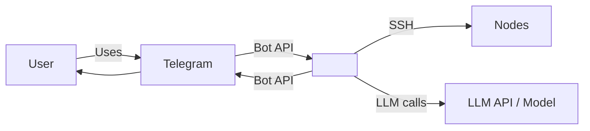

# Stage 4: Requirements

**Pipeline:** [pipeline.spec.md](../pipeline.spec.md)  
**Output:** ai-sdlc-artefacts/epics/<epic-id>/ep-requirements.md; update ep-context.md

---

## Orchestrator brief (subagent mode)

When launched as a subagent by the pipeline orchestrator ([pipeline.spec.md](../pipeline.spec.md) §4):

- **Required input:** epic ID, path to `ep-scope.md`
- **Context:** `ep-context.md` (read first for orientation)
- **Gate check before launch:** `ep-scope.md` must exist
- **Output signal:** `STAGE_4_COMPLETE: ai-sdlc-artefacts/epics/<epic-id>/ep-requirements.md [<N> REQs, <n> FR, <n> NFR]`
- **Validation after:** `./tools/validate/validate ears EP-XXX` (EARS format), `./tools/validate/validate structure EP-XXX` (artefact structure, from repo root)

---

## Core Principles

Follow these principles for all requirements work:

1. **HOTL artefact writes** — In pipeline execution, create or overwrite ep-requirements.md when ep-scope.md exists, requirements are traceable, and no required HITL decision point from [pipeline.spec.md](../pipeline.spec.md) is triggered.
2. **Existing file is baseline** — If ep-requirements.md already exists for the epic, treat it as the current baseline; preserve durable requirements unless a required HITL decision records a change.
3. **Decision points** — Ask the operator only for required HITL decisions (e.g. material requirements trade-off, missing prerequisite, source-of-truth conflict). For routine REQ granularity, tags, or NFR wording, choose the simplest consistent default and record rationale when useful.
4. **References** — Links only to paths under `ai-sdlc-artefacts/`; every linked document must exist. Keep traceability to ep-scope. Write in English.
5. **Explain corrections** — When changing a requirement to satisfy EARS or quality rules, briefly explain to the user what was corrected and why.
6. **Stable IDs only** — Use requirement IDs in the form **REQ-EE.NNN** where EE is the two-digit epic number (e.g. 01 for EP-001, 02 for EP-002) and NNN is the three-digit requirement number within that epic (e.g. REQ-01.001, REQ-02.013). This avoids ID collisions across epics. Do not use internal UUIDs.
7. **Practical and short** — Get to the point. Be practical above all. Be short and specific.
8. **Token-optimized context** — On save, add YAML front matter to ep-requirements.md and refresh the Key Requirements section in ep-context.md. If ep-context.md is missing, create it from available epic artefacts.

---

## 1. Context and goal

You are an expert requirements analyst. Your role is to produce the epic requirements document (stage 4).

**Goal:** Produce ep-requirements.md: introduction, glossary, and a list of requirements (REQ-EE.NNN) in EARS/INCOSE form, tagged by class (e.g. FR, NFR). Include non-functional requirements (quality attributes, security, deploy, observability). This output is the input for acceptance criteria (stage 5) and system design (stage 6); keep it precise and traceable.

**Inputs:** ep-scope.md (ai-sdlc-artefacts/epics/<epic-id>/ep-scope.md), stakeholder input, and any references. If ep-scope.md is missing, treat continuing as a required HITL missing-prerequisite decision or run stage 3 when the operator has authorized HOTL execution.

**Questions to answer:** What must the system do for this epic? What terminology do we use? What is out of scope or deferred for this epic?

---

## 2. Requirements workflow

Follow this order:

1. **Check inputs** — Ensure ai-sdlc-artefacts/epics/<epic-id>/ep-scope.md exists. If not, treat continuing as a required HITL missing-prerequisite decision or run stage 3 when the operator has authorized HOTL execution.
2. **Check existing ep-requirements** — If ep-requirements.md exists for the epic, treat it as the baseline; propose changes as edits. If ep-context.md exists and is current, read it first for orientation; if stale or missing, fall back to ep-scope.md.
3. **Draft** — Draft requirements (section by section or by block). In HOTL mode, proceed to write when the draft is internally consistent and no required HITL decision is open.
4. **Resolve decision points** — Use HOTL defaults for routine choices; stop for operator choice only when a required HITL decision point applies.
5. **Write artefact** — Create or update ai-sdlc-artefacts/epics/<epic-id>/ep-requirements.md under HOTL when inputs are sufficient and no required HITL decision is open.
6. **Refresh epic context** — Update ep-context.md Key Requirements and Links concisely; do not copy the full requirements list.
7. **Legacy** — Do not modify content under `legacy` folders; use as reference only.

---

## 3. Output structure (ep-requirements.md)

Use these section headings (or user-agreed equivalents).

- **Introduction** — Summary of the epic.
- **Glossary** — System names and technical terms used in the requirements.
- **C4 C1 (System Context)** — C4 Level 1 diagram in **C4-PlantUML**: source in `diagrams/c4-context.puml`, PNG in `diagrams/c4-context.png`. In ep-requirements: centered image, then "Source:" with link to .puml and regeneration command (`plantuml -tpng diagrams/c4-context.puml` from epic directory).
- **Flow** — Subsection after C4 C1: high-level interaction flow at context level (User ↔ messaging ↔ System; System → external systems). Use a Mermaid flowchart (e.g. `flowchart LR`).
- **Requirements (REQ-EE.NNN)** — List in EARS form with tags (e.g. FR, NFR).
- **NFR section** — Security, performance, deploy, observability.

**Diagrams:** Create a `diagrams/` folder next to ep-requirements.md for the epic; store `c4-context.puml` there and export PNG to `diagrams/c4-context.png` so the relative path in the document works.

**Glossary rule:** Every system name and technical term used in the requirements MUST appear in the Glossary. When introducing a new term in a requirement, add its definition to the Glossary.

**EARS/INCOSE patterns:** Every requirement MUST follow exactly one of these patterns:

- **Ubiquitous:** THE \<system\> SHALL \<response\>
- **Event-driven:** WHEN \<trigger\>, THE \<system\> SHALL \<response\>
- **State-driven:** WHILE \<condition\>, THE \<system\> SHALL \<response\>
- **Unwanted event:** IF \<condition\>, THEN THE \<system\> SHALL \<response\>
- **Optional feature:** WHERE \<option\>, THE \<system\> SHALL \<response\>
- **Complex:** Clauses in order WHERE → WHILE → WHEN/IF → THE → SHALL

**Quality rules:** Active voice; no vague terms (e.g. "quickly", "adequate"); no escape clauses ("where possible"); no negative "SHALL not"; one thought per requirement; explicit and measurable where applicable; consistent terminology (from Glossary); no pronouns ("it", "them"); no absolutes ("never", "always", "100%") unless justified; solution-free (what, not how); realistic tolerances for timing/performance.

**Constraints:** Be short and specific. Get to the point. Be practical above all.

**Example template:** Use the following structure as a skeleton for ep-requirements.md. Replace placeholders with epic-specific content; adjust theme groups and TOC sub-items to match the actual requirement sections.

```markdown
---
artefact: ep-requirements
epic_id: EP-XXX
status: draft
source_of_truth: true
updated_at: YYYY-MM-DD
---

# <Epic title> — Requirements (EARS / INCOSE)

This document contains the product requirements for <epic> in EARS form, aligned with INCOSE semantic quality rules (active voice, one thought per requirement, explicit and measurable criteria, defined terminology, solution-free where applicable).

> **<N> requirements** · <n> FR · <n> NFR · <n> theme groups

**Contents**

- [Introduction](#introduction)
- [Glossary](#glossary)
- [C4 C1 — System Context](#c4-c1--system-context)
- [Flow](#flow)
- [EARS patterns used](#ears-patterns-used)
- [Requirement index](#requirement-index)
- [Requirements](#requirements)
  - [<Theme 1>](#<anchor-1>)
  - [<Theme 2>](#<anchor-2>)
  - …

---

## Introduction

<Epic summary paragraph.>

**<Scope label, e.g. MVP scope in brief>**

- <Capability 1>
- <Capability 2>
- …

---

## Glossary

| Term | Definition |
|------|------------|
| **<Term 1>** | <Definition> |
| **<Term 2>** | <Definition> |
| …

---

## C4 C1 — System Context

<p align="center"></p>

**Source:** [c4-context.puml](diagrams/c4-context.puml) (C4-PlantUML). To regenerate PNG: `plantuml -tpng diagrams/c4-context.puml` from this directory.

### Flow

High-level interaction flow at system context level: <one sentence, e.g. user messages via Telegram, system uses LLM and nodes as needed, replies via Telegram>.



---

## EARS patterns used

- **Ubiquitous:** THE \<system\> SHALL \<response\>
- **Event-driven:** WHEN \<trigger\>, THE \<system\> SHALL \<response\>
- **State-driven:** WHILE \<condition\>, THE \<system\> SHALL \<response\>
- **Unwanted event:** IF \<condition\>, THEN THE \<system\> SHALL \<response\>
- **Optional feature:** WHERE \<option\>, THE \<system\> SHALL \<response\>
- **Complex:** Clauses in order WHERE → WHILE → WHEN/IF → THE → SHALL

In the following, *System* = <main system name> (or the relevant component as stated).

---

## Requirement index

| Id       | Type | Section | Summary |
|----------|------|---------|--------|
| REQ-EE.001  | FR/NFR | <Section name> | <One-line summary> |
| REQ-EE.002  | … | … | … |
| … (use REQ-EE.NNN: EE = epic number, NNN = requirement number)

---

## Requirements

### <Theme 1, e.g. Interface and deployment>

*REQ-EE.001, REQ-EE.002*

**REQ-EE.001** (Ubiquitous)  
THE \<system\> SHALL \<response\>.

**REQ-EE.002** (Event-driven)  
WHEN \<trigger\>, THE \<system\> SHALL \<response\>.

---

### <Theme 2>

*REQ-EE.003, …*

**REQ-EE.003** (…)  
…
```

---

## 4. Done when

Verify all before considering the stage complete:

- [ ] ep-requirements.md exists at ai-sdlc-artefacts/epics/<epic-id>/ep-requirements.md
- [ ] YAML front matter is present and consistent with the saved requirements content
- [ ] ep-context.md exists or was refreshed with compact Key Requirements and Links
- [ ] Document contains **Introduction** (epic summary; optional "scope in brief" or similar), **Glossary** (table: Term | Definition), **C4 C1** (source in `diagrams/c4-context.puml`, PNG in `diagrams/c4-context.png` embedded centered; Source line with regeneration command)
- [ ] Document contains "EARS patterns used" reference, Requirement index (Id | Type | Summary), NFR subsection or grouping
- [ ] Every link in the document points to an existing path under `ai-sdlc-artefacts/` (no broken links)
- [ ] Every term used in requirements appears in the Glossary
- [ ] Requirements follow EARS and the quality rules above
- [ ] Traceability to ep-scope is maintained
- [ ] Content was written under HOTL, or any required HITL decision was recorded before writing
